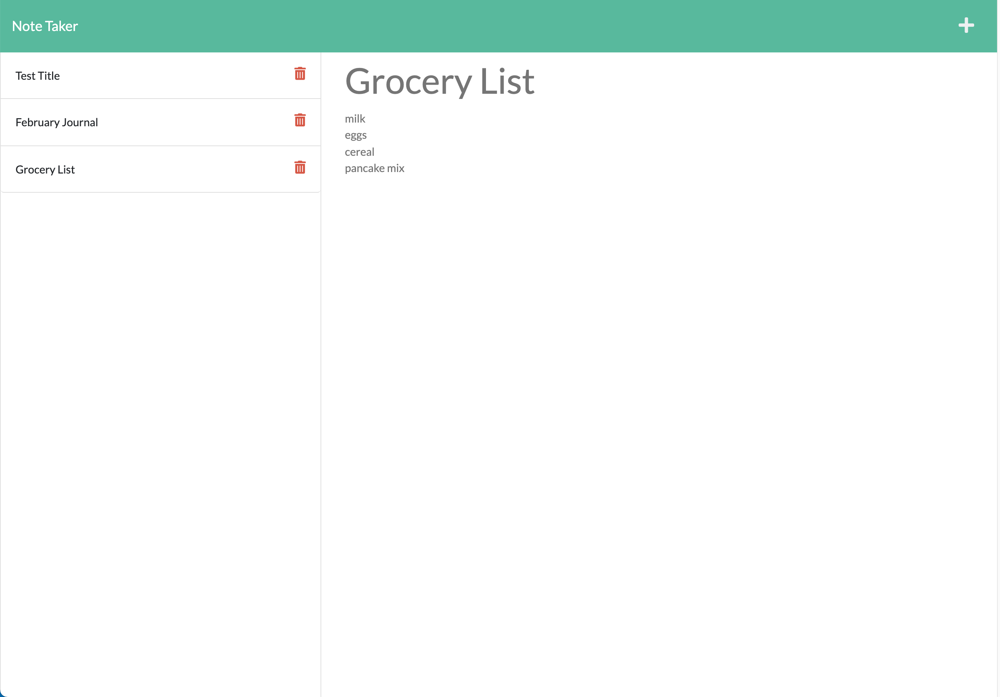

# Note Taker

Developer: Sydney Mercier

For: UT Austin Coding Bootcamp

Deployed: https://note-taker-mercier.herokuapp.com/

## Overview

This is a basic note taking app that allows the user to create and save new notes as well as view or delete existing notes. The front-end was provided as starter code, but it was my responsibility to implement the app's back-end functionality using Express. To accomplish this, I created the necessary GET, POST, and DELETE routes for the notes. Data was written to and read from a JSON file rather than a dedicated database, so I also made helper functions to handle those steps. 